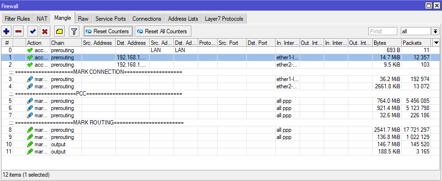

# Konfigurasi-Loadbalance-untuk-customer-Upwork

Nama saya Setiyo Aryo Winata. Pada repositori ini, saya mendokumentasikan konfigurasi Load Balance dengan metode PCC (Per Connection Classifier) pada perangkat MikroTik.

Konfigurasi ini diterapkan untuk kebutuhan pelanggan yang menggunakan dua koneksi internet, yaitu:

ISP 1 dengan bandwidth 100 Mbps

ISP 2 dengan bandwidth 50 Mbps

Tujuan dari konfigurasi ini adalah untuk mengoptimalkan distribusi trafik internet secara seimbang dan stabil, dengan tetap menjaga kestabilan koneksi pada sesi tertentu seperti login, streaming, maupun VPN.

### Topologi Jaringan


### Aktifkan Safe Mode

Dalam proses konfigurasi melalui koneksi VPN, saya mengaktifkan Safe Mode sebagai tindakan preventif untuk mencegah kehilangan akses akibat kesalahan konfigurasi,
sekaligus menyediakan mekanisme rollback atau fall-back otomatis.

### Mangle Bypass Koneksi Lokal
```Shell
/ip firewall mangle
add action=accept chain=prerouting dst-address-list=LAN src-address-list=LAN
add action=accept chain=prerouting dst-address=192.168.1.0/24 in-interface=\ether1-ISP
add action=accept chain=prerouting dst-address=192.168.1.0/24 in-interface=\ether2-50MBPS
```
### Mangle Mark Connection
```Shell
/ip firewall mangle
add action=mark-connection chain=prerouting comment="====================MARK CONNECTION====================" connection-mark=no-mark in-interface=ether1-ISP new-connection-mark=ISP-1-ETH-1 passthrough=yes
add action=mark-connection chain=prerouting connection-mark=no-mark in-interface=ether2-50MBPS new-connection-mark=ISP-2-ETH-2 passthrough=yes
```
### Mangle PCC
```Shell
add action=mark-connection chain=prerouting comment="=====================PCC=================================" connection-mark=ISP-1-ETH-1 dst-address-type=!local in-interface=all-ppp new-connection-mark=ISP-1-ETH-1 passthrough=yes per-connection-classifier=both-addresses-and-ports:3/0
add action=mark-connection chain=prerouting connection-mark=ISP-1-ETH-1 dst-address-type=!local in-interface=all-ppp new-connection-mark=ISP-1-ETH-1 passthrough=yes per-connection-classifier=both-addresses-and-ports:3/1
add action=mark-connection chain=prerouting connection-mark=ISP-2-ETH-2 dst-address-type=!local in-interface=all-ppp new-connection-mark=ISP-2-ETH-2 passthrough=yes per-connection-classifier=both-addresses-and-ports:3/2
```
### Membuat Routing Table
Dikarenakan Mikrotik menggunakan Router OS Versi 7, maka Routing table harus di buat manual.
```Shell
/routing table
add disabled=no fib name=EXIT-ISP-1
add disabled=no fib name=EXIT-ISP-2
```
### Mangle Mark Routing
```Shell
add action=mark-routing chain=prerouting comment="====================MARK ROUTING========================" connection-mark=ISP-1-ETH-1 in-interface=all-ppp new-routing-mark=EXIT-ISP-1 passthrough=no
add action=mark-routing chain=prerouting connection-mark=ISP-2-ETH-2 in-interface=all-ppp new-routing-mark=EXIT-ISP-2 passthrough=no
add action=mark-routing chain=output connection-mark=ISP-1-ETH-1 new-routing-mark=EXIT-ISP-1 passthrough=no
add action=mark-routing chain=output connection-mark=ISP-2-ETH-2 new-routing-mark=EXIT-ISP-2 passthrough=no
```
### Add Default Route dengan Routing Table ISP1 dan ISP2
```Shell
/ip route
add disabled=no distance=1 dst-address=0.0.0.0/0 gateway=192.168.1.1%ether1-ISP pref-src="" routing-table=EXIT-ISP-1 scope=30 suppress-hw-offload=no target-scope=10
add disabled=no distance=1 dst-address=0.0.0.0/0 gateway=192.168.1.1%ether2-50MBPS pref-src="" routing-table=EXIT-ISP-2 scope=30 suppress-hw-offload=no target-scope=10
```
# Add Default Route dengan Routing Table main
```Shell
add disabled=no dst-address=0.0.0.0/0 gateway=192.168.1.1%ether1-ISP routing-table=main suppress-hw-offload=no
add disabled=no distance=2 dst-address=0.0.0.0/0 gateway=192.168.1.1%ether2-50MBPS pref-src="" routing-table=main scope=30 suppress-hw-offload=no target-scope=10
```
### Modifikasi DHCP CLIENT untuk disable default Route
```Shell
/ip dhcp-client
add add-default-route=no interface=ether1-ISP
add add-default-route=no interface=ether2-50MBPS use-peer-dns=no
```



## Disclaimer

Perlu diketahui bahwa perangkat MikroTik yang digunakan sudah memiliki konfigurasi dasar (basic configuration) sebelumnya.
Pada dokumentasi ini, saya hanya menambahkan konfigurasi untuk implementasi Load Balance menggunakan metode PCC (Per Connection Classifier) guna mengoptimalkan penggunaan dua jalur internet yang tersedia.

Terimakasih.


